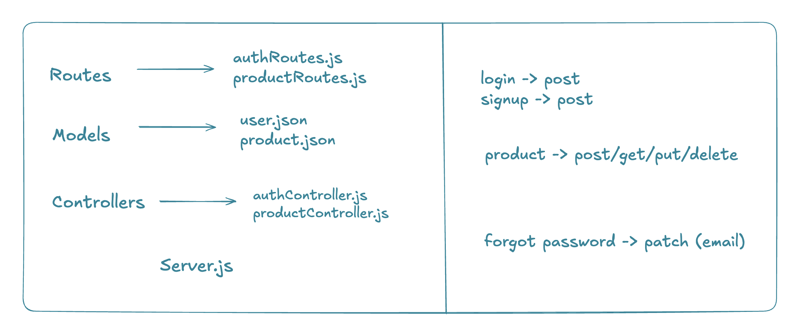

# Node.js API Project

This is a simple **Node.js REST API** structured using the **MVC (Model–View–Controller)** pattern.  
It includes authentication and product management using JSON files as the data store.


## 📁 Project Structure

```
├── controllers
│   ├── authController.js
│   └── productController.js
│
├── models
│   ├── user.json
│   └── product.json
│
├── routes
│   ├── authRoutes.js
│   └── productRoutes.js
│
├── node_modules
├── server.js
├── package.json
└── package-lock.json

````


---

## 🧠 Architecture Overview

### Controllers
- **AuthController.js**  
  Handles user authentication logic (register, login, etc.)

- **ProductController.js**  
  Handles product CRUD operations

### Models
- **user.json**  
  Stores user data (acts as a simple database)

- **product.json**  
  Stores product data

### Routes
- **AuthRoute.js**  
  Defines authentication-related endpoints

- **ProductRoute.js**  
  Defines product-related endpoints

### Server
- **server.js**  
  Entry point of the application. Sets up Express, middleware, and routes.

---

## Getting Started

### 1. Install Dependencies
```bash
npm install
````

### 2. Run the Server

```bash
node server.js
```

*or (if using nodemon):*

```bash
nodemon server.js
```

---

## 🌐 API Endpoints 

### Auth Routes

```
POST /auth/register
POST /auth/login
POST /auth/forgot-password
```

### Product Routes

```
GET    /products
POST   /products
PUT    /products/:id
DELETE /products/:id
```


---

## 🛠 Tech Stack

* Node.js
* Express.js
* JavaScript
* JSON (for data persistence)

---

## 📌 Notes

* This project uses **JSON files instead of a database**, suitable for learning or small demos.
* For production use, replace JSON models with a real database (MongoDB, PostgreSQL, etc.).
* Passwords should be hashed (e.g., using `bcrypt`) if not already implemented.
